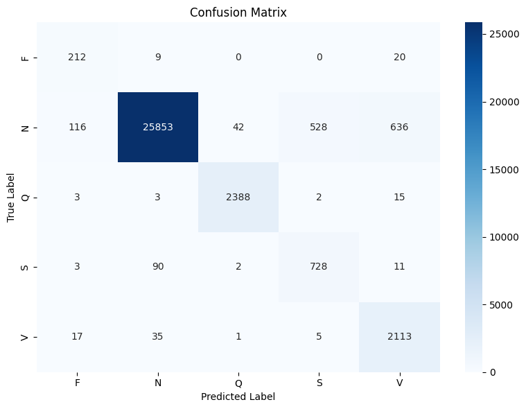

# 🫀📊 ECG Arrhythmia Classification

This project focuses on classifying arrhythmias using ECG signals from the MIT-BIH Arrhythmia Database. It applies machine learning (and optionally deep learning) models to detect and classify various cardiac abnormalities.

---

## 📂 Dataset

**MIT-BIH Arrhythmia Database**  
- Source: [PhysioNet MIT-BIH Database](https://physionet.org/content/mitdb/1.0.0/)  
- 48 records (each 30 minutes, 2 channels, 360 Hz sampling)  
- Covers common and rare arrhythmias  
- Channel 1: MLII (Modified Limb Lead II)  
- Channel 2: V1 / V2 / V5  

To access the dataset:
```bash
pip install wfdb
```
```python
import wfdb
record = wfdb.rdrecord('100', pn_dir='mitdb')
```

---

##  ECG Signal Processing Workflow

###  Introduction  
Electrocardiograms (ECG) are vital tools in diagnosing and monitoring heart conditions. With the increasing integration of machine learning in healthcare, preparing ECG data for automated classification systems is essential. This section explains an end-to-end signal processing pipeline using Python, applied to records from the **MIT-BIH Arrhythmia Database**. The steps include normalization, filtering, annotation correction, beat segmentation, and feature extraction.

---

###  Stage 1: Loading and Preprocessing ECG Signals
- ECG data is imported from `.csv` files containing:
  - A sample index (or timestamp)
  - Two ECG channels (typically MLII and V5)
- **Normalization**:
  - Raw ADC values are centered by subtracting `1024`
  - Scaled by dividing by `200` to convert to millivolts (mV)
- **Filtering**:
  - A **bandpass FIR filter** (0.5–50 Hz) removes noise and drift
  - Applied using **zero-phase filtering (`filtfilt`)**

---

###  Stage 2: Annotation Cleanup and Label Correction
- Annotations (e.g., N, V, A) mark beat types
- Missing/placeholder labels are replaced using a secondary source
- Corrections are logged for transparency
- No annotations are dropped

---

###  Stage 3: ECG Beat Segmentation
- A **1-second window (360 samples)** is extracted around each beat (180 before & 180 after)
- 2-channel output → 2 × 360 matrix per beat
- Segments are flattened to 720-length vectors
- Only complete 360-sample segments are kept

---

### 📤 Stage 4: Exporting Processed Data
- Processed segments and labels are saved to Excel:
  - `123_segments.xlsx`: Flattened 720-sample ECG segments
  - `123_labels.xlsx`: Corresponding beat labels
- Ready for use with tools like **scikit-learn**, **TensorFlow**, **Excel**, etc.

---

###  Stage 5: ECG Feature Extraction from Segmented Signals
After preprocessing and segmenting the ECG signals, the next step involves extracting **informative features** that summarize the signal’s characteristics. These features are essential for machine learning-based arrhythmia detection.

This step processes 2-lead ECG segments (2 × 360 samples) and extracts **30 features per segment**—15 from each channel.

#### 📥 Input  
Excel files like `123_segments.xlsx`, each with ECG beat segments.

#### 📤 Output  
Excel files like `123_features.xlsx` saved in a `features/` subfolder.  
Each row = 30 extracted features per segment.

---

###  Features Extracted per Channel (15 total)

####  1. Statistical Features (7)
- **Mean**, **Standard Deviation**, **Min**, **Max**
- **Median**, **Skewness**, **Kurtosis**

####  2. Time-Domain Features (4)
- **Zero Crossing Rate**
- **RMS (Root Mean Square)**
- **IEMG (Integrated EMG)**
- **Waveform Length**

####  3. Hjorth Parameters (3)
- **Activity** (Variance)
- **Mobility** (1st derivative std dev)
- **Complexity** (2nd derivative dynamics)

####  4. Frequency-Domain Feature (1)
- **Band Energy (0–10 Hz)** using Welch’s method

> 🔢 15 features × 2 channels = **30 features per ECG beat**

These features offer a compact yet descriptive representation of ECG morphology and dynamics, well-suited for ML classifiers.

---

##  Label Grouping, Data Merging, and Final Classification

###  Step 1: Subject File Merging
- Loops through subject IDs from 100 to 234
- Loads corresponding feature and label Excel files
- Merges them horizontally (side-by-side)
- Saves as a new Excel file (e.g., `subject114.xlsx`)

---

###  Step 2: ECG Label Grouping
**Objective:** Standardize beat labels into 5 main classes:
- `'N'`: ['N', 'L', 'R', 'e', 'j']
- `'S'`: ['A', 'a', 'J', 'S']
- `'V'`: ['V', 'E']
- `'Q'`: ['/', 'f', 'Q']
- `'F'`: 
This script:
- Reads each `subjectXXX.xlsx` file
- Replaces original labels using the grouping rules
- Outputs cleaned versions

---

### 🧮 Step 3: Dataset Concatenation
- Combines all cleaned subject files into one big dataset
- Final output: `combined_ecg_data.xlsx`

---

###  Step 4: Balancing the Dataset
- Split data into training (70%) and test (30%)
- Apply balancing **only to training** using:
  - Undersampling (e.g., limit class 'N')
  - SMOTE oversampling for minority classes
  - Optional: Tomek links to clean overlaps

📤 Outputs:
- `train_balanced_8000.xlsx`: Balanced training data
- `test_imbalanced.xlsx`: Raw test data

Original vs Balanced Label Distributions:

| Stage | N | Q | V | S | F |
|-------|---|---|---|---|---|
| Original Train | 63407 | 5627 | 5064 | 1947 | 561 |
| Original Test  | 27175 | 2411 | 2171 | 834  | 241 |
| After Undersample | 8000 | 5627 | 5064 | 1947 | 561 |
| After SMOTE | 8000 | 8000 | 8000 | 8000 | 8000 |
| After Tomek | 7816 | 7924 | 7905 | 7920 | 8000 |

 Balanced training set and imbalanced test set saved successfully.

---

###  Step 5: Final Classification & Evaluation
Using **Random Forest** classifier with `class_weight='balanced'`:

- **Training Set:** Balanced data
- **Test Set:** Real-world imbalanced data
- **Metrics**:
  - Accuracy: `0.9532`
  - F1-score, precision, recall per class
  - Confusion matrix visualized

Confusion Matrix:
```
[[  212     9     0     0    20]
 [  116 25853    42   528   636]
 [    3     3  2388     2    15]
 [    3    90     2   728    11]
 [   17    35     1     5  2113]]
```

**Classification Report:**

| Label | Precision | Recall | F1-score | Support |
|-------|-----------|--------|----------|---------|
| F     | 0.60      | 0.88   | 0.72     | 241     |
| N     | 0.99      | 0.95   | 0.97     | 27175   |
| Q     | 0.98      | 0.99   | 0.99     | 2411    |
| S     | 0.58      | 0.87   | 0.69     | 834     |
| V     | 0.76      | 0.97   | 0.85     | 2171    |

➡️ Macro Avg F1-score: **0.84**, Accuracy: **95.32%**

---

### 📊 Confusion Matrix



## 📜 License

This project is open source under the MIT License.
